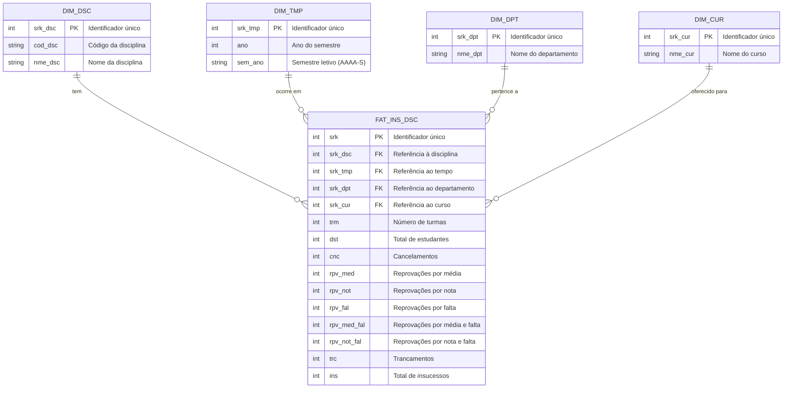

# Modelo Entidade-Relacionamento (ME-R) - Camada Gold

## Visão Geral

Este documento apresenta o modelo entidade-relacionamento (ME-R) para a camada Gold do projeto UNB FCTE Data Journey, baseado no modelo dimensional (Star Schema) implementado no Data Warehouse.

## Análise dos Dados Processados

**Schema**: `dw` (Data Warehouse)  
**Modelo**: Star Schema (Modelo Dimensional)  
**Estrutura**: 4 tabelas dimensionais + 1 tabela de fatos  
**Tabela Original**: `public.disciplinas` (tabela desnormalizada de origem)

**Observação Importante**: A camada Gold implementa um modelo dimensional normalizado, separando as informações descritivas (dimensões) das métricas numéricas (fatos), otimizando consultas analíticas e reduzindo redundância de dados.

## Modelo de Dados

O modelo segue o padrão **Star Schema** (Schema Estrela), onde uma tabela central de fatos (`fat_ins_dsc`) é conectada a múltiplas tabelas dimensionais através de chaves estrangeiras. Este modelo é otimizado para consultas analíticas e relatórios.


## Entidades

### Tabelas Dimensionais

#### 1. DIM_DSC

**Descrição**: Representa as disciplinas oferecidas pela universidade, contendo informações descritivas sobre cada disciplina.

**Atributos**:
- **`srk_dsc`** (INT, PK): Identificador único autoincrementado (GENERATED ALWAYS AS IDENTITY)
- **`cod_dsc`** (VARCHAR(100), NOT NULL): Código único da disciplina (ex: MAT0025, CIC0004, FGA0038)
- **`nme_dsc`** (VARCHAR(100), NOT NULL): Nome oficial da disciplina

**Observação**: Cada disciplina é representada uma única vez nesta tabela, eliminando redundância.

#### 2. DIM_TMP

**Descrição**: Representa a dimensão temporal, contendo informações sobre os semestres letivos.

**Atributos**:
- **`srk_tmp`** (INT, PK): Identificador único autoincrementado (GENERATED ALWAYS AS IDENTITY)
- **`ano`** (INT, NOT NULL): Ano do semestre letivo (ex: 2023, 2024, 2025)
- **`sem-ano`** (VARCHAR(100), NOT NULL): Semestre letivo no formato AAAA-S (ex: 2023-2, 2024-1)

**Observação**: Permite análises temporais e agregações por período.

#### 3. DIM_DPT

**Descrição**: Representa os departamentos acadêmicos responsáveis pelas disciplinas.

**Atributos**:
- **`srk_dpt`** (INT, PK): Identificador único autoincrementado (GENERATED ALWAYS AS IDENTITY)
- **`nme_dpt`** (VARCHAR(100), NOT NULL): Nome completo do departamento (ex: MAT, CIC, FGA, IFD)

**Observação**: Centraliza informações sobre departamentos, facilitando manutenção e análises por unidade acadêmica.

#### 4. DIM_CUR

**Descrição**: Representa os cursos aos quais as turmas pertencem.

**Atributos**:
- **`srk_cur`** (INT, PK): Identificador único autoincrementado (GENERATED ALWAYS AS IDENTITY)
- **`nme_cur`** (VARCHAR(100), NOT NULL): Nome do curso (ex: Software, Automotiva)

**Observação**: Permite análises comparativas entre diferentes cursos.

### Tabela de Fatos

#### FAT_INS_DSC

**Descrição**: Tabela central que armazena as métricas de insucesso acadêmico para cada combinação de disciplina, tempo, departamento e curso.

**Atributos de Relacionamento (Chaves Estrangeiras)**:
- **`srk_dsc`** (INT, NOT NULL, FK): Referência a `dim_dsc(srk_dsc)`
- **`srk_tmp`** (INT, NOT NULL, FK): Referência a `dim_tmp(srk_tmp)`
- **`srk_dpt`** (INT, NOT NULL, FK): Referência a `dim_dpt(srk_dpt)`
- **`srk_cur`** (INT, NOT NULL, FK): Referência a `dim_cur(srk_cur)`

**Atributos de Métricas**:
- **`trm`** (INT, DEFAULT 0): Número de turmas ofertadas da disciplina no semestre/curso
- **`dst`** (INT, DEFAULT 0): Número total de estudantes matriculados na disciplina
- **`cnc`** (INT, DEFAULT 0): Número de cancelamentos de matrícula
- **`rpv_med`** (INT, DEFAULT 0): Número de reprovações por média insuficiente
- **`rpv_not`** (INT, DEFAULT 0): Número de reprovações por nota específica
- **`rpv_fal`** (INT, DEFAULT 0): Número de reprovações por excesso de faltas
- **`rpv_med_fal`** (INT, DEFAULT 0): Número de reprovações por média insuficiente e excesso de faltas
- **`rpv_not_fal`** (INT, DEFAULT 0): Número de reprovações por nota específica e excesso de faltas
- **`trc`** (INT, DEFAULT 0): Número de trancamentos de matrícula
- **`ins`** (INT, DEFAULT 0): Soma total de insucessos (calculado)

**Chave Primária**: `srk_fat_ins_dsc` (INT, GENERATED ALWAYS AS IDENTITY)

**Observação**: Cada registro representa uma combinação única de disciplina, tempo, departamento e curso, com suas respectivas métricas de insucesso.

## Relacionamentos

### DIM_DSC → FAT_INS_DSC
- **Cardinalidade**: 1:N (Um para Muitos)
- **Descrição**: Uma disciplina pode ter múltiplos registros de fatos (em diferentes semestres, cursos, etc.)
- **Integridade Referencial**: `ON DELETE CASCADE` - Se uma disciplina for removida, todos os fatos relacionados são removidos

### DIM_TMP → FAT_INS_DSC
- **Cardinalidade**: 1:N (Um para Muitos)
- **Descrição**: Um período de tempo pode ter múltiplos registros de fatos (diferentes disciplinas, cursos, etc.)
- **Integridade Referencial**: `ON DELETE CASCADE` - Se um período for removido, todos os fatos relacionados são removidos

### DIM_DPT → FAT_INS_DSC
- **Cardinalidade**: 1:N (Um para Muitos)
- **Descrição**: Um departamento pode ter múltiplos registros de fatos (diferentes disciplinas, semestres, cursos, etc.)
- **Integridade Referencial**: `ON DELETE CASCADE` - Se um departamento for removido, todos os fatos relacionados são removidos

### DIM_CUR → FAT_INS_DSC
- **Cardinalidade**: 1:N (Um para Muitos)
- **Descrição**: Um curso pode ter múltiplos registros de fatos (diferentes disciplinas, semestres, departamentos, etc.)
- **Integridade Referencial**: `ON DELETE CASCADE` - Se um curso for removido, todos os fatos relacionados são removidos

## Chaves Primárias

- **DIM_DSC**: `srk_dsc` (INT, autoincrementado)
- **DIM_TMP**: `srk_tmp` (INT, autoincrementado)
- **DIM_DPT**: `srk_dpt` (INT, autoincrementado)
- **DIM_CUR**: `srk_cur` (INT, autoincrementado)
- **FAT_INS_DSC**: `srk_fat_ins_dsc` (INT, autoincrementado)

## Diagrama Entidade-Relacionamento (DER)

O modelo segue o padrão Star Schema, onde a tabela de fatos está no centro, conectada às tabelas dimensionais.

O **Diagrama Entidade-Relacionamento (DER)** representa o modelo conceitual do banco de dados, mostrando as entidades, seus atributos e os relacionamentos entre elas de forma abstrata, sem detalhes de implementação física.


### Diagrama Mermaid



## Diagrama Lógico de Dados (DLD)

O **Diagrama Lógico de Dados (DLD)** representa a estrutura física do banco de dados, mostrando detalhes de implementação como tipos de dados, tamanhos de campos, chaves primárias, chaves estrangeiras, constraints, índices e outros elementos técnicos específicos do SGBD (Sistema Gerenciador de Banco de Dados).

**Diferenças entre DER e DLD**:
- **DER**: Foco no modelo conceitual, relacionamentos e cardinalidades
- **DLD**: Foco na implementação física, tipos de dados, constraints e detalhes técnicos

O DLD abaixo representa a implementação do modelo no PostgreSQL, conforme definido no arquivo `DDL.sql`.


## Exemplos de Consultas

### Exemplo 1: Total de Insucessos por Departamento
```sql
SELECT 
    d.nme_dpt,
    SUM(f.ins) AS total_insucessos
FROM dw.fato_ins f
JOIN dw.dim_dpt d ON f.srk_dpt = d.srk_dpt
GROUP BY d.nme_dpt
ORDER BY total_insucessos DESC;
```


### Exemplo 2: Evolução Temporal de Disciplina
```sql
SELECT 
    t.ano,
    t.sem_ano,
    dsc.nme_dsc,
	cur.nme_cur,
    f.dst,
    f.ins
FROM dw.fat_ins f
JOIN dw.dim_tmp t ON f.srk_tmp = t.srk_tmp
JOIN dw.dim_dsc dsc ON f.srk_dsc = dsc.srk_dsc
JOIN dw.dim_cur cur ON f.srk_cur = cur.srk_cur
WHERE dsc.cod_dsc = 'MAT0025'
ORDER BY t.ano, t.sem_ano, cur.nme_cur;
```


### Exemplo 3: Comparação entre Cursos
```sql
SELECT 
    c.nme_cur,
    COUNT(DISTINCT f.srk_dsc) AS total_disciplinas,
    SUM(f.dst) AS total_discentes,
    SUM(f.ins) AS total_insucessos,
    ROUND(SUM(f.ins)::NUMERIC / SUM(f.dst) * 100, 2) AS taxa_insucesso
FROM dw.fat_ins f
JOIN dw.dim_cur c ON f.srk_cur = c.srk_cur
GROUP BY c.nme_cur;
```


## Tabela Original

A tabela `public.disciplinas` serve como fonte de dados para o Data Warehouse. Esta tabela contém os dados desnormalizados originais, que são transformados e distribuídos entre as dimensões e a tabela de fatos durante o processo de ETL.

**Estrutura da Tabela Original**:
- `id` (INT, PK): Identificador único autoincrementado
- `codigo` (VARCHAR(100)): Código da disciplina
- `nome` (VARCHAR(100)): Nome da disciplina
- `turmas` (INT): Número de turmas
- `discentes` (INT): Total de estudantes
- `cancelamentos` (INT): Cancelamentos
- `reprovacoesMedia` (INT): Reprovações por média
- `reprovacoesNota` (INT): Reprovações por nota
- `reprovacoesFalta` (INT): Reprovações por falta
- `reprovacoesMediaFalta` (INT): Reprovações por média e falta
- `reprovacoesNotaFalta` (INT): Reprovações por nota e falta
- `trancamentos` (INT): Trancamentos
- `insucessos` (INT): Total de insucessos
- `semestre` (VARCHAR(100)): Semestre letivo
- `departamento` (VARCHAR(100)): Departamento
- `curso` (VARCHAR(100)): Curso

---

*Última atualização: 2025*  
*Versão: 1.0 - Modelo Dimensional (Star Schema)*

