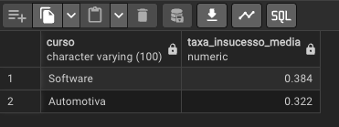
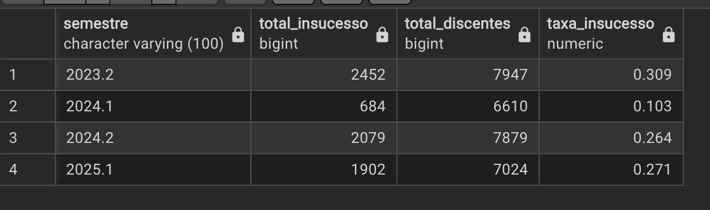
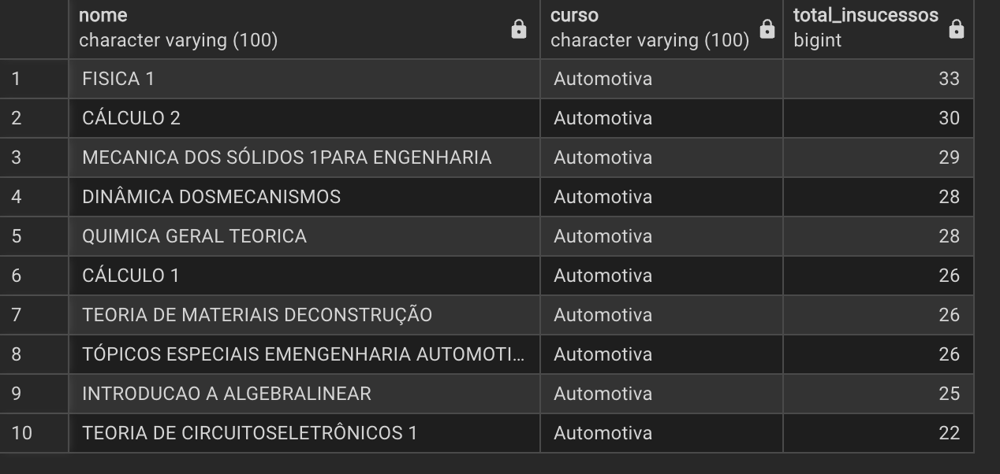
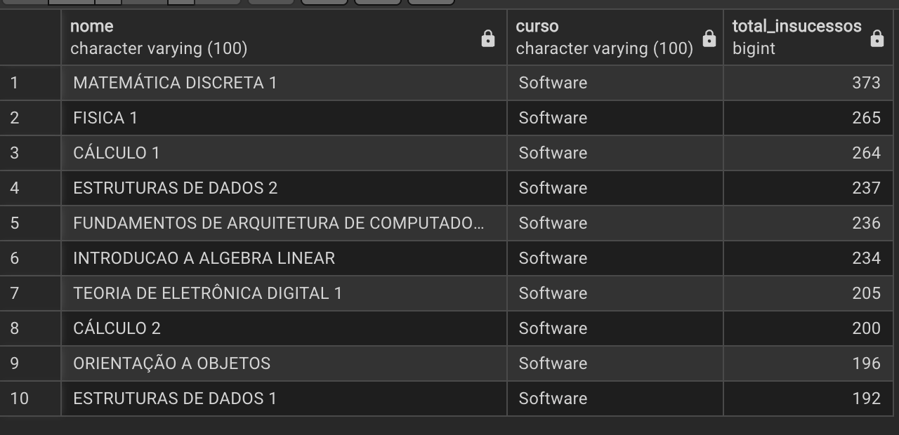

## Consultas SQL

Este documento contém uma coleção de consultas SQL e os insights gerados a partir da base de dados de insucesso acadêmico (reprovações, trancamentos e cancelamentos).

### 1. Taxa média de insucesso por curso
Mostra quais cursos têm, proporcionalmente, mais alunos com insucesso.

```sql
SELECT 
    curso,
    ROUND(AVG(insucessos::numeric / NULLIF(discentes, 0)), 3) AS taxa_insucesso_media
FROM disciplinas
GROUP BY curso
ORDER BY taxa_insucesso_media DESC;
```



### 2. Distribuição dos tipos de insucesso
Mostra a soma dos diferentes tipos de insucesso, ajudando a identificar o principal motivo de reprovações.

```sql
SELECT
	curso, 
    SUM(cancelamentos) AS cancelamentos,
    SUM(reprovacoesmedia) AS reprovacoes_media,
    SUM(reprovacoesfalta) AS reprovacoes_falta,
    SUM(trancamentos) AS trancamentos
FROM disciplinas
GROUP BY curso;
```


### 3. Evolução temporal de insucessos por semestre
Permite avaliar se o desempenho acadêmico está melhorando ou piorando ao longo do tempo.
```sql
SELECT 
    semestre,
    SUM(insucessos) AS total_insucesso,
    SUM(discentes) AS total_discentes,
    ROUND(SUM(insucessos)::numeric / NULLIF(SUM(discentes), 0), 3) AS taxa_insucesso
FROM disciplinas
GROUP BY semestre
ORDER BY semestre;
```


### 4. 10 Disciplinas com mais insucessos de Automotiva
```sql
SELECT
    nome,
    curso,
    SUM(insucessos) AS total_insucessos
FROM disciplinas
WHERE curso = 'Automotiva' 
GROUP BY nome, curso
ORDER BY total_insucessos DESC
LIMIT 10;
```


### 5. 10 Disciplinas com mais insucessos de Software
```sql
SELECT
    nome,
    curso,
    SUM(insucessos) AS total_insucessos
FROM disciplinas
WHERE curso = 'Software' 
GROUP BY nome, curso
ORDER BY total_insucessos DESC
LIMIT 10;
```

