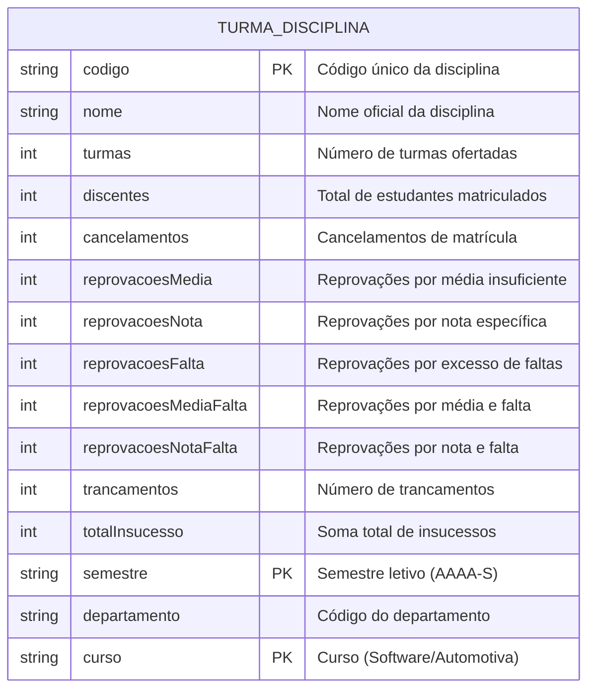

# Modelo Entidade-Relacionamento (ME-R) - Camada Silver

## Visão Geral

Este documento apresenta o modelo entidade-relacionamento (ME-R) para a camada Silver do projeto UNB FCTE Data Journey, baseado nos dados processados do lakehouse de dados.

## Análise dos Dados Processados

**Arquivo**: `lista-insucesso-processed.csv`  
**Formato**: CSV delimitado por ponto e vírgula (;)  
**Registros**: 987 linhas (986 registros + cabeçalho)  
**Colunas**: 15 campos  
**Período**: 4 semestres (2023-2, 2024-1, 2024-2, 2025-1)  
**Cursos**: Software (610 registros) e Automotiva (263 registros)

**Observação Importante**: Cada registro representa uma **TURMA** de uma disciplina em um semestre específico de um curso, com suas respectivas métricas de insucesso acadêmico.

## Modelo de Dados

Como os dados estão em uma única tabela plana, o modelo é simplificado, contendo apenas uma entidade com todos os atributos necessários para representar as informações de insucesso acadêmico.

## Entidade

### TURMA_DISCIPLINA

**Descrição**: Representa uma turma de disciplina em um semestre específico de um curso, contendo todas as métricas de insucesso acadêmico associadas.

**Observação**: Esta é uma tabela desnormalizada que contém tanto informações descritivas (código, nome, departamento, curso, semestre) quanto métricas numéricas (turmas, discentes, cancelamentos, reprovações, etc.).

## Atributos

- **`codigo`** (VARCHAR): Código único da disciplina (ex: MAT0025, CIC0004, FGA0038)
  - Exemplos: ADM0014, FGA0038, MAT0025, CIC0004
  - Formato: 3 letras (departamento) + 4 dígitos
  
- **`nome`** (VARCHAR): Nome oficial da disciplina
  - Exemplos: "CÁLCULO 1", "ALGORITMOS E PROGRAMAÇÃO DE COMPUTADORES", "AERODINÂMICA DE SISTEMAS AEROESPACIAIS"

- **`semestre`** (VARCHAR): Semestre letivo no formato AAAA-S (ex: 2023-2, 2024-1)
  - Valores possíveis: 2023-2, 2024-1, 2024-2, 2025-1
  
- **`departamento`** (VARCHAR): Código do departamento responsável pela disciplina
  - Exemplos: MAT (Matemática), CIC (Ciência da Computação), FGA (Faculdade do Gama), IFD (Física)
  - Observação: Geralmente corresponde aos primeiros 3 caracteres do código da disciplina
  
- **`curso`** (VARCHAR): Curso ao qual a turma pertence
  - Valores possíveis: "Software", "Automotiva"


- **`turmas`** (INTEGER): Número de turmas ofertadas da disciplina no semestre/curso
  - Valor mínimo: 1
  - Exemplo: 8 turmas de CÁLCULO 1 no semestre 2023-2 para Software
  
- **`discentes`** (INTEGER): Número total de estudantes matriculados na disciplina
  - Valor mínimo: 0
  - Exemplo: 306 discentes em CÁLCULO 1 no semestre 2023-2 para Software


- **`cancelamentos`** (INTEGER): Número de cancelamentos de matrícula
  - Valor mínimo: 0
  
- **`reprovacoesMedia`** (INTEGER): Número de reprovações por média insuficiente
  - Valor mínimo: 0
  - Nome no CSV: "Reprovações Média"
  
- **`reprovacoesNota`** (INTEGER): Número de reprovações por nota específica
  - Valor mínimo: 0
  - Nome no CSV: "Reprovações Nota"
  
- **`reprovacoesFalta`** (INTEGER): Número de reprovações por excesso de faltas
  - Valor mínimo: 0
  - Nome no CSV: "Reprovações Falta"
  
- **`reprovacoesMediaFalta`** (INTEGER): Número de reprovações por média insuficiente e excesso de faltas
  - Valor mínimo: 0
  - Nome no CSV: "Reprovações Média e Falta"
  
- **`reprovacoesNotaFalta`** (INTEGER): Número de reprovações por nota específica e excesso de faltas
  - Valor mínimo: 0
  - Nome no CSV: "Reprovações Nota e Falta"
  
- **`trancamentos`** (INTEGER): Número de trancamentos de matrícula
  - Valor mínimo: 0
  
- **`totalInsucesso`** (INTEGER): Soma total de insucessos (calculado)
  - Valor mínimo: 0
  - Nome no CSV: "Total Insucesso"
  - Fórmula: cancelamentos + reprovacoesMedia + reprovacoesNota + reprovacoesFalta + reprovacoesMediaFalta + reprovacoesNotaFalta + trancamentos

## Chave Primária

**Chave Primária Composta**: (`codigo`, `semestre`, `curso`)

Esta combinação garante a unicidade de cada registro, pois uma disciplina não pode ter duas turmas idênticas no mesmo semestre e curso.

## Diagrama Entidade-Relacionamento

Como o modelo contém apenas uma entidade, não há relacionamentos entre entidades. O diagrama representa apenas a estrutura da tabela única.


## Diagrama Lógico

Como o modelo contém apenas uma entidade, não há relacionamentos entre entidades. O diagrama representa apenas a estrutura da tabela única.


### Diagrama Mermaid



## Regras de Negócio

### 1. Identificação de Departamentos
- O código do departamento geralmente corresponde aos primeiros 3 caracteres do código da disciplina
- Exemplo: MAT0025 → Departamento MAT (Matemática)
- Exemplo: CIC0004 → Departamento CIC (Ciência da Computação)

### 2. Chave Primária Composta
- A chave primária é composta por (`codigo`, `semestre`, `curso`)
- Garante unicidade: uma disciplina não pode ter duas turmas no mesmo semestre e curso
- Permite que a mesma disciplina tenha turmas em diferentes semestres e/ou cursos

### 3. Cálculo do Total de Insucesso
- `totalInsucesso` = cancelamentos + reprovacoesMedia + reprovacoesNota + reprovacoesFalta + reprovacoesMediaFalta + reprovacoesNotaFalta + trancamentos
- Este valor deve ser validado para garantir consistência dos dados

### 4. Validações
- `discentes` >= `totalInsucesso` (não pode ter mais insucessos que matrículas)
- `turmas` >= 1 (pelo menos uma turma deve ser ofertada)
- Todos os campos numéricos >= 0 (não podem ser negativos)
- `semestre` deve seguir o formato AAAA-S (ex: 2023-2)
- `curso` deve ser "Software" ou "Automotiva"

### 5. Formato de Semestre
- O semestre é armazenado no formato AAAA-S (ano-semestre)
- Semestre 1: primeiro semestre do ano (janeiro-junho)
- Semestre 2: segundo semestre do ano (julho-dezembro)

## Exemplos de Dados Reais

### Disciplina Recorrente: CÁLCULO 1 (MAT0025)

**Curso: Software**
```
Código: MAT0025
Nome: CÁLCULO 1
Turmas: 8
Discentes: 306
Cancelamentos: 5
Reprovações Média: 103
Reprovações Nota: 0
Reprovações Falta: 29
Reprovações Média e Falta: 0
Reprovações Nota e Falta: 0
Trancamentos: 12
Total Insucesso: 149
Semestre: 2023-2
Departamento: MAT
Curso: Software
```

**Curso: Automotiva**
```
Código: MAT0025
Nome: CÁLCULO 1
Turmas: 4
Discentes: 18
Cancelamentos: 0
Reprovações Média: 13
Reprovações Nota: 0
Reprovações Falta: 0
Reprovações Média e Falta: 0
Reprovações Nota e Falta: 0
Trancamentos: 2
Total Insucesso: 15
Semestre: 2023-2
Departamento: MAT
Curso: Automotiva
```
