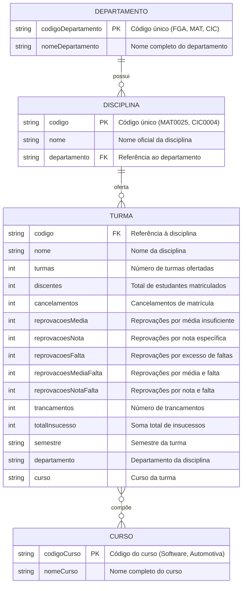

# Modelo Entidade-Relacionamento (ME-R) - Camada Silver

## Visão Geral

Este documento apresenta o modelo entidade-relacionamento (ME-R) para a camada Silver do projeto UNB FCTE Data Journey, baseado nos dados processados e enriquecidos do lakehouse de dados, seguindo o padrão de modelagem especificado.

## Análise dos Dados Processados

### Estrutura da Camada Silver

**Arquivo**: `lista-insucesso-processed.csv`  
**Registros**: 987 linhas (986 registros + cabeçalho)  
**Colunas**: 15 campos  
**Período**: 4 semestres (2023.2, 2024.1, 2024.2, 2025.1)  
**Cursos**: Software (610 registros) e Automotiva (263 registros)

**Observação Importante**: Cada registro representa uma **TURMA** de uma disciplina em um semestre específico de um curso, com suas respectivas métricas de insucesso acadêmico.

## Entidades

1. **DISCIPLINA**: Matéria/curso oferecido pela universidade
2. **DEPARTAMENTO**: Unidade acadêmica responsável pelas disciplinas
3. **CURSO**: Modalidade/área de formação (Software, Automotiva)
4. **TURMA**: Turma específica de uma disciplina em um semestre e curso

## Atributos

**DISCIPLINA** (codigo, nome, departamento)

**DEPARTAMENTO** (codigoDepartamento, nomeDepartamento)

**CURSO** (codigoCurso, nomeCurso)

**TURMA** (codigo, nome, turmas, discentes, cancelamentos, reprovacoesMedia, reprovacoesNota, reprovacoesFalta, reprovacoesMediaFalta, reprovacoesNotaFalta, trancamentos, totalInsucesso, semestre, departamento, curso)

## Relacionamentos

**DEPARTAMENTO – possui – DISCIPLINA**
Um DEPARTAMENTO pode possuir nenhuma, uma ou várias DISCIPLINAs e uma DISCIPLINA pode ser possuída por nenhum ou um DEPARTAMENTO
Cardinalidade: (1 : n)

**DISCIPLINA – oferta – TURMA**
Uma DISCIPLINA pode ofertar zero, uma ou várias TURMAs, mas uma TURMA só pode ser ofertada por uma DISCIPLINA
Cardinalidade: (1 : n)

**TURMA – compõe – CURSO**
Uma TURMA pode compor zero, um ou vários CURSOS e um CURSO pode ser composto por uma ou várias TURMAs
Cardinalidade: (n : m)

## Diagrama Entidade-Relacionamento


### Diagrama Mermaid (Alternativo)



## Detalhamento das Entidades

### 1. DEPARTAMENTO

**Descrição**: Unidade acadêmica responsável por um conjunto de disciplinas

**Atributos**:
- `codigoDepartamento` (PK): Código único do departamento (ex: FGA, MAT, CIC)
- `nomeDepartamento`: Nome completo do departamento

**Dados Reais Identificados**:
- FGA: 454 registros (Faculdade do Gama)
- MAT: 60 registros (Matemática)
- CIC: 41 registros (Ciência da Computação)
- CEM: 31 registros (Química)
- IFD: 36 registros (Física)
- E outros 40+ departamentos

### 2. DISCIPLINA

**Descrição**: Matéria/curso oferecido pela universidade

**Atributos**:
- `codigo` (PK): Código único da disciplina (ex: MAT0025, CIC0004)
- `nome`: Nome oficial da disciplina
- `departamento` (FK): Referência ao departamento responsável

**Dados Reais**: 433 disciplinas únicas identificadas

### 3. CURSO

**Descrição**: Modalidade/área de formação acadêmica

**Atributos**:
- `codigoCurso` (PK): Código único do curso (ex: Software, Automotiva)
- `nomeCurso`: Nome completo do curso

**Dados Reais**:
- Software: 610 registros
- Automotiva: 263 registros

### 4. TURMA

**Descrição**: Turma específica de uma disciplina em um semestre e curso, com suas métricas de insucesso acadêmico

**Atributos**:
- `codigo` (FK): Referência à disciplina
- `nome`: Nome da disciplina
- `turmas`: Número de turmas ofertadas
- `discentes`: Número total de estudantes matriculados
- `cancelamentos`: Número de cancelamentos de matrícula
- `reprovacoesMedia`: Reprovações por média insuficiente
- `reprovacoesNota`: Reprovações por nota específica
- `reprovacoesFalta`: Reprovações por excesso de faltas
- `reprovacoesMediaFalta`: Reprovações por média e falta
- `reprovacoesNotaFalta`: Reprovações por nota e falta
- `trancamentos`: Número de trancamentos
- `totalInsucesso`: Soma total de insucessos
- `semestre`: Semestre da turma (valor textual)
- `departamento`: Departamento da disciplina
- `curso`: Curso da turma

**Chave Primária Composta**: (codigo, semestre, curso)

## Regras de Negócio

### 1. Identificação de Departamentos
- O código do departamento é extraído dos primeiros 3 caracteres do código da disciplina
- Exemplo: MAT0025 → Departamento MAT (Matemática)

### 2. Chave Primária Composta
- A chave primária de TURMA é composta por (codigo, semestre, curso)
- Garante unicidade: uma disciplina não pode ter duas turmas no mesmo semestre e curso
- **Nota**: Embora os dados atuais mostrem turmas separadas por curso, o modelo permite turmas mistas (alunos de diferentes cursos na mesma turma)

### 3. Cálculo do Total de Insucesso
- `totalInsucesso` = cancelamentos + reprovacoesMedia + reprovacoesNota + reprovacoesFalta + reprovacoesMediaFalta + reprovacoesNotaFalta + trancamentos

### 4. Validações
- `discentes` >= `totalInsucesso` (não pode ter mais insucessos que matrículas)
- `turmas` >= 1 (pelo menos uma turma deve ser ofertada)
- Todos os campos numéricos >= 0

## Exemplos de Dados Reais

### Disciplina Recorrente: CÁLCULO 1 (MAT0025)
```
MAT0025;CÁLCULO 1;8;306;5;103;0;29;0;0;12;149;2023.2;MAT;Software
MAT0025;CÁLCULO 1;5;171;14;10;0;5;0;0;0;29;2024.1;MAT;Software
MAT0025;CÁLCULO 1;5;107;8;32;0;14;0;0;6;60;2024.2;MAT;Software
MAT0025;CÁLCULO 1;5;45;4;14;0;2;0;0;6;26;2025.1;MAT;Software
MAT0025;CÁLCULO 1;4;18;0;13;0;0;0;0;2;15;2023.2;MAT;Automotiva
MAT0025;CÁLCULO 1;4;9;2;0;0;0;0;0;0;2;2024.1;MAT;Automotiva
MAT0025;CÁLCULO 1;2;8;0;1;0;2;0;0;2;5;2024.2;MAT;Automotiva
MAT0025;CÁLCULO 1;2;5;2;0;0;1;0;0;1;4;2025.1;MAT;Automotiva
```

**Observação**: Cada linha representa uma **TURMA** da disciplina CÁLCULO 1 em um semestre específico de um curso específico, com suas respectivas métricas de insucesso.

---

*Última atualização: $(date)*  
*Versão: 1.0*  